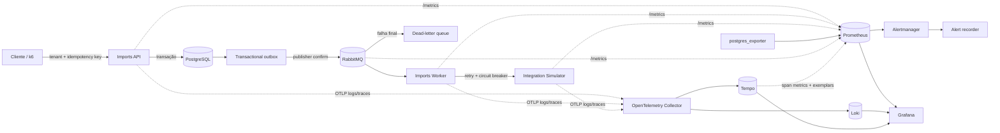

# Kube Observability Lab

[](https://github.com/AsafeFerreira/devops-observability-lab/actions/workflows/ci.yml)

Plataforma multiusuário de importação assíncrona criada como projeto independente de portfólio para demonstrar infraestrutura, observabilidade e rotinas operacionais de uma aplicação web em containers e Kubernetes.

O projeto não altera nem depende do Korp: ele o complementa com evidências práticas das competências de DevOps que faltavam no portfólio — Prometheus, Grafana, OpenTelemetry, Loki, Tempo, alertas, GitHub Actions, Kubernetes, carga, backup e runbooks.

> Este é um laboratório local, não um ambiente de produção. As falhas são intencionais, `LAB_MODE` só deve ser habilitado localmente e as credenciais versionadas são exclusivamente didáticas.

## O que funciona

- API Go multi-tenant para criar e consultar importações, com idempotência por cliente.
- PostgreSQL com migrações embutidas e transactional outbox.
- RabbitMQ com publisher confirms, consumo manual, retries, circuit breaker e dead-letter queue.
- Worker Go que processa os eventos e chama um simulador de integração externa.
- Logs estruturados por cliente e componente, com `correlation_id`, `trace_id` e `span_id`.
- Métricas Prometheus sem IDs de cliente em labels de alta cardinalidade.
- Traces distribuídos da requisição HTTP ao banco, fila, worker e integração.
- Grafana provisionado com cinco dashboards e navegação entre métricas, logs e traces.
- Alertas de disponibilidade, erros, latência, recursos, banco, fila, worker e integração.
- Registro local dos eventos `firing` e `resolved` enviados pelo Alertmanager.
- Testes unitários, integração, smoke, carga com k6 e backup/restore com comparação.
- Docker Compose para demonstração rápida e manifests `kind`/Kubernetes para o laboratório de cluster.
- CI e rotina semanal no GitHub Actions, com relatórios como artifacts.
- Runbooks, ADRs e estudos comparativos de provisionamento, dependências e segredos.

## Arquitetura



Detalhes de decisões, fluxo e modelo de telemetria estão em [docs/architecture.md](docs/architecture.md).

## Início rápido com Docker Compose

Pré-requisitos: Docker com Compose v2, `curl`, `python3` e, para desenvolvimento, Go 1.26.5.

```bash
make setup
make up
make smoke
make integration
```

Depois, acesse:

| Recurso | URL | Credencial local |
|---|---|---|
| API | http://localhost:8080 | cabeçalho `X-Tenant-ID` |
| Grafana | http://localhost:3000 | `admin` / `observability_dev` |
| Prometheus | http://localhost:9090 | — |
| Alertmanager | http://localhost:9093 | — |
| RabbitMQ | http://localhost:15672 | `observability` / `observability_dev` |
| Loki | http://localhost:3100/ready | — |
| Tempo | http://localhost:3200/ready | — |

Para encerrar preservando volumes:

```bash
make down
```

## Exemplo de uso

```bash
curl --fail-with-body \
  -X POST http://localhost:8080/api/v1/imports \
  -H 'Content-Type: application/json' \
  -H 'X-Tenant-ID: client-a' \
  -H 'X-Correlation-ID: demo-2026-001' \
  -H 'Idempotency-Key: demo-import-2026-001' \
  --data '{"source":"erp","recordCount":100}'
```

Fontes especiais só produzem falhas quando `LAB_MODE=true`:

| `source` | Comportamento |
|---|---|
| `normal` ou `erp` | processamento bem-sucedido |
| `slow` | adiciona 800 ms de latência |
| `flaky` | falha de forma intermitente |
| `force-error` | falha sempre, exercita retry, breaker e DLQ |

Os endpoints e contratos completos estão em [docs/api.md](docs/api.md).

## Testes e rotinas

```bash
make test                 # unitários, race detector e coverage
make compose-validate     # modelo do Compose
make smoke                # health/readiness de toda a stack
make integration          # sucesso, idempotência e falha/DLQ
make load                 # k6 + artifacts/k6-summary.json
make backup               # dump, restore isolado e comparação
./scripts/simulate-failure.sh integration
./scripts/simulate-failure.sh evidence
```

O teste de backup cria um banco temporário cujo nome começa com `lab_restore_check_`, restaura o dump, compara importações e migrações e remove somente esse banco temporário. O dump e o relatório ficam em `artifacts/`, que não é versionado.

## Kubernetes com kind

Pré-requisitos adicionais: `kind`, `kubectl` e `helm`.

```bash
make kind-up
make smoke
make integration
```

O script cria exclusivamente o cluster `observability-lab`, carrega as três imagens locais, instala uma versão fixada de `kube-prometheus-stack`, aplica Loki/Tempo/Collector, provisiona os dashboards e implanta a aplicação via Kustomize. API e Grafana continuam em `localhost:8080` e `localhost:3000`.

```bash
make kind-down
```

`kind-down` apaga apenas o cluster nomeado e avisa que seus dados locais não são recuperáveis.

## Dashboards e alertas

Os dashboards são provisionados em código:

1. Platform Overview — golden signals, status das importações e traces recentes.
2. Logs by Client and Component — filtros de cliente, serviço e correlação.
3. Processing and Messaging — filas, DLQ, retries, breaker e integração.
4. PostgreSQL — disponibilidade, pool, conexões, transações e latência.
5. Kubernetes Resources — pods, reinícios, CPU/memória e nós.

As regras Prometheus possuem severidade, categoria, descrição e link para o runbook correspondente. O inventário e a forma de provar cada cenário estão em [docs/observability.md](docs/observability.md) e [docs/evidence/README.md](docs/evidence/README.md).

## Evidências

Execuções reais registradas em [docs/evidence/](docs/evidence/), com os
comandos usados e os valores obtidos por consulta às APIs.

| Cenário | Resultado verificado |
| --- | --- |
| [Falha de integração](docs/evidence/incident-2026-08-20-dead-letter.md) | Trace com 15 spans e 10 marcados como erro, mostrando três tentativas de retry antes do dead-letter |
| [Indisponibilidade de serviço](docs/evidence/incident-2026-08-20-service-down.md) | Ciclo `firing` às 02:15:45 e `resolved` às 02:19:15, com detecção após o `for: 60s` da regra |
| [Teste de carga](docs/evidence/operations-2026-08-20.md#teste-de-carga-k6) | 301 iterações, 0,00% de falhas e p95 de 7,4 ms contra um limite de 750 ms |
| [Backup e restauração](docs/evidence/operations-2026-08-20.md#verificação-de-backup-e-restauração) | 3643 importações restauradas em banco temporário e comparadas, com limpeza conferida |
| [Integração contínua](docs/evidence/operations-2026-08-20.md#integração-contínua) | Quatro jobs aprovados, com relatórios publicados como artifacts |

As oito capturas de tela estão publicadas em
[docs/evidence/](docs/evidence/): dashboards, logs por cliente, trace
distribuído, alerta disparado e resolvido, carga, backup e CI aprovado.

Nenhuma imagem foi montada e nenhum número foi estimado. Os cenários são
reproduzíveis com os comandos descritos em cada documento.

## Como este projeto se encaixa na vaga

| Atividade ou requisito | Evidência neste repositório |
|---|---|
| Painéis por cliente e componente | Dashboard `02-tenant-logs.json`, tenant como metadata estruturada |
| Relacionar logs, métricas e traces | W3C Trace Context, exemplars, derived field para Tempo e trace-to-logs |
| Alertas de aplicações, banco e nós | Regras Compose e `PrometheusRule` Kubernetes |
| Alertas de integração/importação | falhas, breaker, backlog e DLQ |
| Ambiente de testes | Compose completo e overlay `kind` |
| Rotinas periódicas e relatórios | workflow `operations.yml` e artifacts |
| Teste de carga | k6 com thresholds e JSON de resultado |
| Verificação de backups | dump, restore isolado e comparação automática |
| Runbooks | nove procedimentos versionados em `docs/runbooks/` |
| Estudos técnicos | provisionamento, dependências e gestão de segredos |
| Docker/Kubernetes | Dockerfiles multi-stage, Compose, Kustomize, probes e resources |
| PostgreSQL/SQL | schema, constraints, índices, transações e outbox |
| Python/Bash | gravador de alertas em Python e automações POSIX shell |
| GitHub Actions | qualidade, configuração, integração, segurança e rotina semanal |

O mapa detalhado para currículo e entrevista está em [docs/portfolio-evidence.md](docs/portfolio-evidence.md). Ele separa claramente o que foi implementado do que ainda exigiria experiência real de produção.

## Segurança e decisões conscientes

- Imagens e charts têm versões explícitas; não há `latest`.
- Serviços Go executam como usuário sem privilégios e os workloads removem Linux capabilities.
- Segredos reais não devem entrar no Git. O overlay local usa valores didáticos; alternativas reais são analisadas no estudo de segredos.
- Logs não registram payloads completos, senhas nem URLs de conexão.
- `tenant_id`, `correlation_id` e `trace_id` ficam nos logs; `tenant_id` não vira label de métrica Prometheus.
- O scanner do CI verifica vulnerabilidades, segredos e misconfigurations.

Leia [SECURITY.md](SECURITY.md) antes de adaptar o laboratório para outro ambiente.

## Versões principais

Versões avaliadas em 19/08/2026 e fixadas nos arquivos de infraestrutura:

| Componente | Versão |
|---|---:|
| Go | 1.26.5 |
| PostgreSQL | 18.4 |
| RabbitMQ | 4.2.9 |
| OpenTelemetry Collector Contrib | 0.159.0 |
| Prometheus | 3.13.2 |
| Alertmanager | 0.33.1 |
| Grafana | 13.1.1 |
| Loki | 3.7.5 |
| Tempo | 2.10.7 |
| postgres_exporter | 0.20.1 |
| k6 | 2.1.0 |
| kube-prometheus-stack chart | 88.0.1 |

A justificativa para usar Tempo 2.10 no laboratório single-binary está no [ADR 0001](docs/decisions/0001-observability-stack.md).

## Estrutura

```text
cmd/                    serviços Go
internal/               domínio, banco, mensageria, telemetria e HTTP
migrations/             schema SQL versionado
deploy/                 Compose configs, dashboards, alertas e Kubernetes
scripts/                rotinas operacionais reproduzíveis
tests/load/             cenário k6
docs/runbooks/           resposta a falhas comuns
docs/studies/            estudos comparativos curtos
docs/decisions/          decisões arquiteturais (ADRs)
.github/workflows/       CI e rotina periódica
```

## Limitações honestas

- O projeto demonstra operação local e não afirma experiência autônoma em produção.
- Persistência do overlay `kind` usa `emptyDir`; a rotina de backup é demonstrada no Compose.
- As APIs de logs do OpenTelemetry Go ainda têm maturidade diferente de traces e métricas; a decisão está documentada no ADR de telemetria.
- Credenciais, retenção, alta disponibilidade e armazenamento de objetos precisam ser redesenhados para produção.

## Licença

[MIT](LICENSE).
