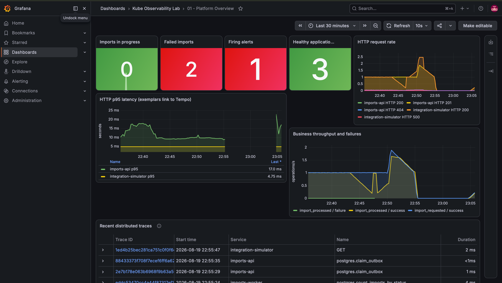
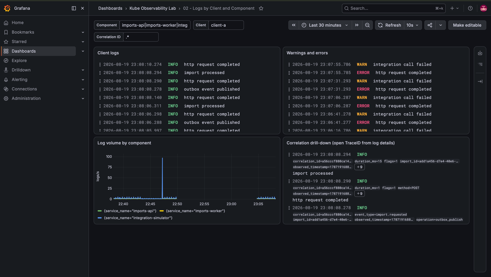
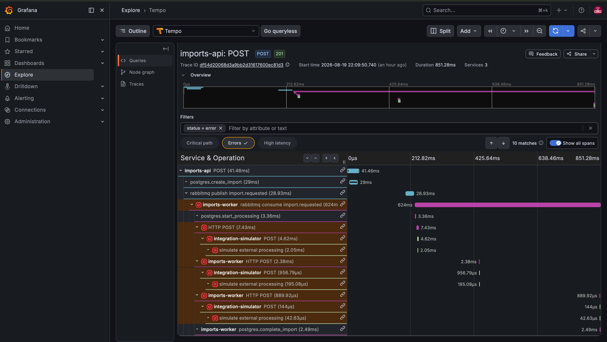

# Incidente simulado: falha de integração e dead-letter

Execução real do laboratório em 2026-08-20, registrada para demonstrar a
correlação entre métricas, logs, traces e alertas. Nenhum dado deste
documento foi fabricado: todos os valores vieram de consultas às APIs do
Prometheus, Loki, Tempo e Alertmanager durante a execução.

## Como reproduzir

```sh
make up
sh scripts/simulate-failure.sh integration
```

O cenário envia uma importação com `source=force-error`, que faz o
simulador de integração responder erro de forma determinística.

## 1. Gatilho

Importação `28166017-fab5-4a3f-9536-229865a09efc`, tenant `client-a`,
correlation id `failure-1787188190-22635`. Estado final `DEAD_LETTER`
após o esgotamento das tentativas.

## 2. Métrica (Prometheus)

| Consulta | Resultado |
| --- | --- |
| `sum by (result) (lab_integration_calls_total)` | `success=300`, `failure=3` |
| `sum by (status) (lab_imports_current)` | `SUCCEEDED=301`, `DEAD_LETTER=2` |
| `lab_circuit_breaker_state` | `0` (fechado — três falhas não atingem o limiar) |

As três falhas correspondem às três tentativas do worker sobre a mesma
importação, e não a três importações distintas.

## 3. Log (Loki)

Consulta: `{service_name="imports-worker"} |= "dead-letter"`

```
msg            = import sent to dead-letter queue
detected_level = error
service_name   = imports-worker
trace_id       = df54d20068d3a9bb2d31617600ec81d3
span_id        = 59db068b3ba20f91
correlation_id = failure-1787188190-22635
```

O `trace_id` presente no log é o que permite saltar do painel de logs
para o trace correspondente no Tempo.

## 4. Trace distribuído (Tempo)

Trace `df54d20068d3a9bb2d31617600ec81d3` — 15 spans atravessando os três
serviços:

```
imports-api            POST                                41.5ms
imports-api            postgres.create_import              29.0ms
imports-api            rabbitmq publish import.requested   28.9ms
imports-worker         rabbitmq consume import.requested  624.0ms  erro
imports-worker         postgres.start_processing            3.4ms
imports-worker         HTTP POST                            7.4ms  erro   <- tentativa 1
integration-simulator  POST                                 4.6ms  erro
integration-simulator  simulate external processing         2.0ms  erro
imports-worker         HTTP POST                            2.4ms  erro   <- tentativa 2
integration-simulator  POST                                 1.0ms  erro
integration-simulator  simulate external processing         0.2ms  erro
imports-worker         HTTP POST                            0.9ms  erro   <- tentativa 3
integration-simulator  POST                                 0.1ms  erro
integration-simulator  simulate external processing         0.0ms  erro
imports-worker         postgres.complete_import             2.5ms
```

O trace evidencia a política de retry: três chamadas HTTP do worker ao
simulador, todas com status de erro, com a duração caindo a cada
tentativa porque o simulador falha mais cedo. A importação só é marcada
como dead-letter depois da terceira falha.

No Grafana, o filtro `status = error` sobre este trace retorna
**10 matches**, correspondendo aos dez spans marcados com erro acima. O
span `rabbitmq consume import.requested`, de 624 ms, engloba as três
tentativas e a espera entre elas, tornando o backoff visível na linha do
tempo. O span final `postgres.complete_import` não tem erro: é a
gravação do estado dead-letter depois de esgotadas as tentativas.

## 5. Alerta (Alertmanager)

```
LabImportDeadLettered [critical] -> active
One or more imports reached the dead-letter queue
runbook: docs/runbooks/dead-letter.md
```

O ciclo completo `firing` -> `resolved` fica registrado pelo alert
recorder e pode ser consultado com:

```sh
sh scripts/simulate-failure.sh evidence
```

## Capturas

As consultas acima comprovam o comportamento por API; as imagens abaixo
registram as mesmas informações na interface.

### Visão geral da plataforma



### Logs por cliente e componente



### Trace distribuído com as tentativas de retry


