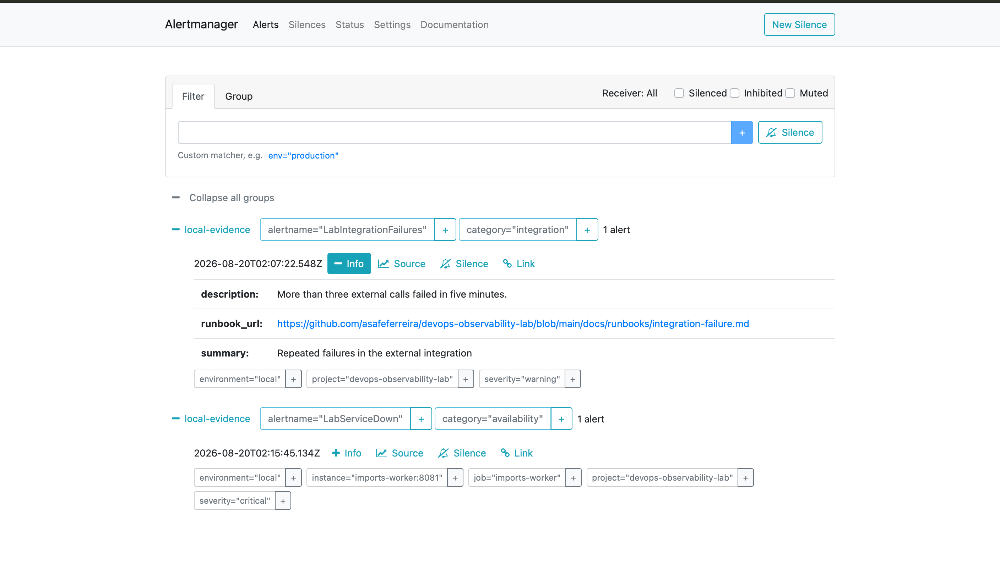
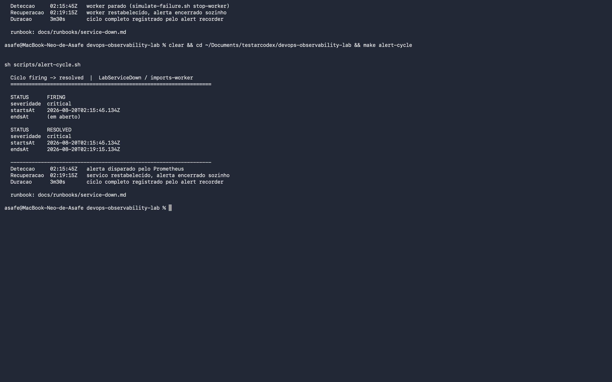

# Incidente simulado: indisponibilidade de serviço

Execução real do laboratório em 2026-08-20, demonstrando o ciclo completo
de detecção e recuperação de um alerta. Os horários abaixo vieram das APIs
do Prometheus e do Alertmanager e do registro do alert recorder.

## Como reproduzir

```sh
sh scripts/simulate-failure.sh stop-worker
# aguarde cerca de um minuto
sh scripts/simulate-failure.sh recover-worker
```

## Linha do tempo

| Horário (UTC) | Evento |
| --- | --- |
| 01:43:11 | `imports-worker` parado |
| 01:44:30 | Prometheus registra `up{job="imports-worker"} = 0` |
| 01:44:49 | `LabServiceDown` entra em **firing** |
| 01:47:08 | `imports-worker` reiniciado |
| 01:47:40 | Alerta sai da lista de ativos |
| 01:47:49 | `LabServiceDown` registrado como **resolved** |

Tempo total do ciclo: cerca de três minutos, dos quais um minuto
corresponde ao `for: 60s` da regra, que evita alarme por falha
transitória de scrape.

## Regra que disparou

```promql
up{job=~"imports-api|imports-worker|integration-simulator"} == 0
```

`for: 60s`, severidade `critical`, categoria `availability`.

## Alertas observados

Durante a indisponibilidade o Alertmanager exibiu dois alertas com
severidades distintas:

| Alerta | Severidade | Labels relevantes |
| --- | --- | --- |
| `LabServiceDown` | critical | `instance=imports-worker:8081`, `job=imports-worker` |
| `LabIntegrationFailures` | warning | `category=integration` |

Ambos carregam `environment=local` e `project=devops-observability-lab`,
usados no roteamento, e um `runbook_url` apontando para o procedimento
correspondente neste repositório.

## Efeito nos painéis

No dashboard `01 - Platform Overview`, durante a queda:

- **Healthy application targets**: caiu de `3` para `2`
- **Firing alerts**: subiu para `2`

## Verificação independente

O smoke test detectou a indisponibilidade enquanto ela durava:

```
FAIL Imports worker (http://localhost:18081/health/ready)
```

Após o restabelecimento, `up{job="imports-worker"}` voltou a `1` e a
lista de alertas ativos ficou vazia.

## Repetição do cenário às 02:15

O mesmo incidente foi reproduzido durante a captura das evidências,
confirmando que o comportamento é determinístico:

| Horário (UTC) | Evento |
| --- | --- |
| 02:15:45 | `LabServiceDown` entra em **firing** |
| 02:19:15 | `LabServiceDown` registrado como **resolved** |

Ciclo de 3m30s, com o mesmo `for: 60s` de detecção. As capturas abaixo
correspondem a esta repetição.

O ciclo pode ser impresso a qualquer momento a partir do registro do
alert recorder:

```sh
make alert-cycle
```

## Capturas

### Alertas disparados



Captura do Alertmanager às 02:16, mostrando `LabServiceDown` com
severidade `critical` na instância `imports-worker:8081` e
`LabIntegrationFailures` com severidade `warning`, cada um com seu
`runbook_url`.

### Ciclo completo registrado



Saída de `make alert-cycle` com os dois eventos do mesmo alerta: o
registro `FIRING` com `endsAt` em aberto e o `RESOLVED` com `endsAt`
preenchido em `02:19:15`, encerrado automaticamente após o worker voltar.
