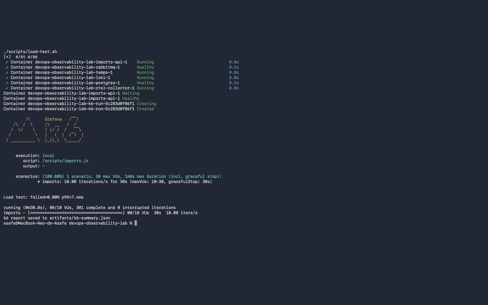
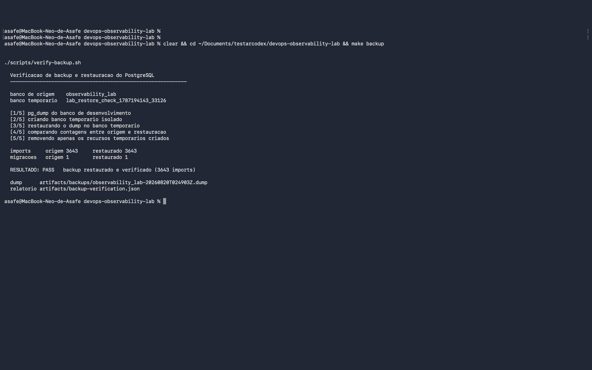
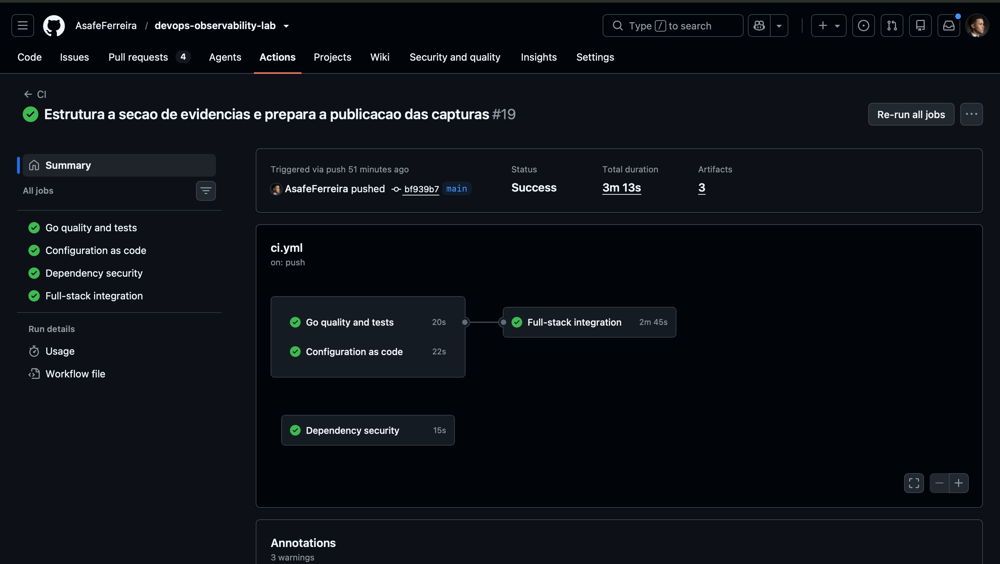

# Rotinas operacionais: carga, backup e integração contínua

Resultados de execuções reais em 2026-08-20. Os números vieram dos
artefatos gerados pelos próprios scripts e da API do GitHub Actions.

## Teste de carga (k6)

```sh
make load
```

Cenário `imports`: 10 usuários virtuais, taxa constante de 10 iterações
por segundo durante 30 segundos, submetendo importações à API.

| Métrica | Resultado | Limite configurado |
| --- | --- | --- |
| Iterações completas | 301 | — |
| Requisições falhas | 0,00% | `rate < 1%` |
| Latência p95 | 9,52 ms | `p(95) < 750 ms` |
| Latência média | 5,01 ms | — |
| Latência máxima | 56,51 ms | — |

Verificações funcionais:

- `import accepted` — 301 aprovações, 0 falhas
- `response has import id` — 301 aprovações, 0 falhas

Ambos os thresholds passaram com folga.

### Reexecução às 02:41

O laboratório foi exercitado novamente durante a captura das evidências:

| Métrica | Resultado |
| --- | --- |
| Iterações completas | 301 |
| Requisições falhas | 0,00% |
| Latência p95 | 7,4 ms |

`artifacts/k6-summary.json`, versionado como evidência, corresponde a
esta reexecução e é o resultado mostrado na captura desta seção.

## Verificação de backup e restauração

```sh
make backup
```

Saída da execução:

```
OK   backup restored and verified (2262 imports)
```

Registro em `artifacts/backup-verification.json`:

```json
{
  "verifiedAt": "2026-08-20T01:50:47Z",
  "backup": "artifacts/backups/observability_lab-20260820T015045Z.dump",
  "imports": 2262,
  "migrations": 1,
  "result": "pass"
}
```

O script gera o dump, cria um banco temporário, restaura, compara a
contagem de registros e destrói apenas o banco que ele mesmo criou.
Conferido após a execução: restam somente `postgres` e
`observability_lab`, sem resíduos do teste.

### Reexecução às 02:49

Após a carga acima, o volume de dados cresceu e a verificação foi
repetida. A saída passou a detalhar cada etapa do procedimento:

```
  banco de origem    observability_lab
  banco temporario   lab_restore_check_1787194143_33126

  [1/5] pg_dump do banco de desenvolvimento
  [2/5] criando banco temporario isolado
  [3/5] restaurando o dump no banco temporario
  [4/5] comparando contagens entre origem e restauracao
  [5/5] removendo apenas os recursos temporarios criados

  imports     origem 3643     restaurado 3643
  migracoes   origem 1        restaurado 1

  RESULTADO: PASS   backup restaurado e verificado (3643 imports)
```

A comparação lado a lado entre origem e restauração é o que prova a
integridade: 3643 importações e 1 migração em ambos os bancos.
`artifacts/backup-verification.json` corresponde a esta reexecução e é o
resultado mostrado na captura desta seção.

## Integração contínua

Execução: https://github.com/AsafeFerreira/devops-observability-lab/actions/runs/32322340716

| Job | Resultado | Duração |
| --- | --- | --- |
| Go quality and tests | aprovado | 17s |
| Configuration as code | aprovado | 10s |
| Dependency security | aprovado | 15s |
| Full-stack integration | aprovado | 2m45s |

O job de integração sobe a stack completa no runner, aguarda os health
checks, executa smoke test e cenários ponta a ponta, verifica o backup e
encerra os containers mesmo em caso de falha.

### Execução capturada

A captura desta seção mostra a execução seguinte, também na `main`:
https://github.com/AsafeFerreira/devops-observability-lab/actions/runs/32322947729

| Job | Resultado | Duração |
| --- | --- | --- |
| Go quality and tests | aprovado | 20s |
| Configuration as code | aprovado | 22s |
| Dependency security | aprovado | 15s |
| Full-stack integration | aprovado | 2m45s |

Duração total de 3m13s, com três artifacts publicados.

## Capturas

### Teste de carga



### Verificação de backup



### Integração contínua


